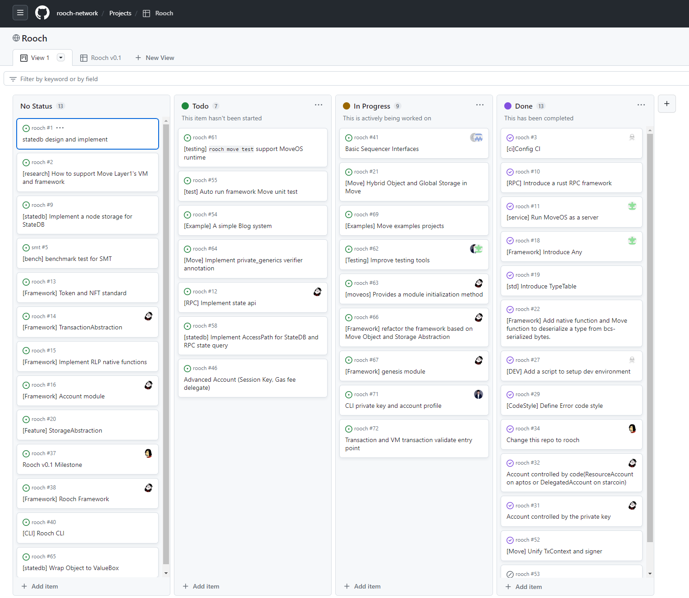

import PostHeader from "/components/blog/postHeader";

<PostHeader />

## 议程一

Jolestar Wang 发布 Rooch 路线图的相关任务，在社区开发会议上给开发者分派 Rooch v0.1 的相关开发任务以及 Rooch 成员认领相关开发任务。

> [GitHub 上的任务列表](https://github.com/orgs/rooch-network/projects/3/views/1)

## 议程二

开发者如何加入 Rooch 开发团队？

### 流程

1. 在 Discord 联系 Rooch 的团队成员，获取开发会议链接
2. 参与我们的 Rooch 开发者社区会议
3. 完成 Rooch 开发任务列表中的某一个新手任务
4. 通过一次简单的会议面聊，决定是以兼职还是全职方式进入 Rooch 的开发团队

### 聘用方式

- 兼职：以完成相关的 issue 任务结算工资，时间灵活
- 全职：以全职方式参与 Rooch v1.0 项目开发

## 议程三 Rooch 工作量证明

进入 Rooch 团队后，无论是兼职还是全职，需要在 Rooch Notion 上记录工作日志，供团队同步进度以及工作证明。

研究类的工作成果可以通过视频、文章、Twitter 等形式输出，任何开发以及研究相关的问题都使用 Discord 公开讨论，方便团队成员了解开发情况和相关问题讨论。
